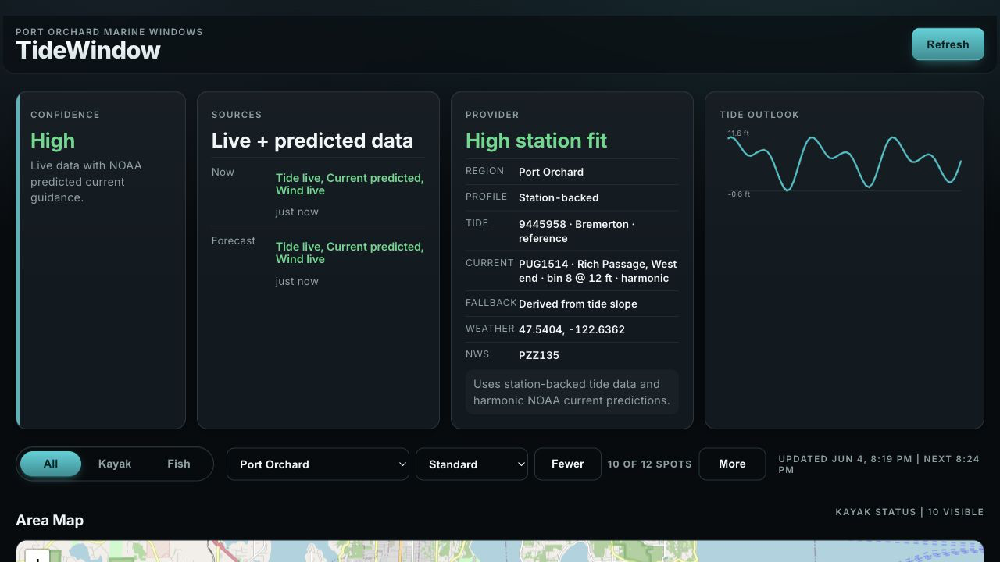
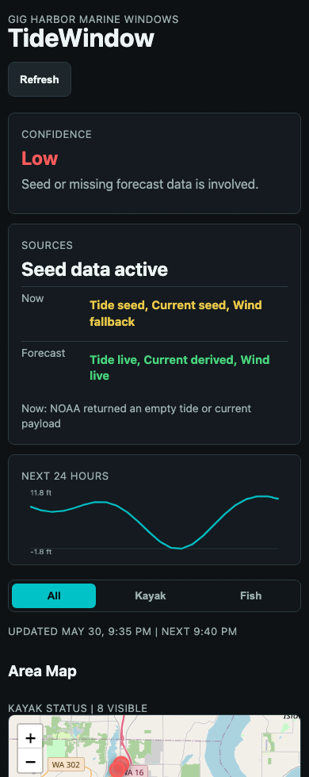
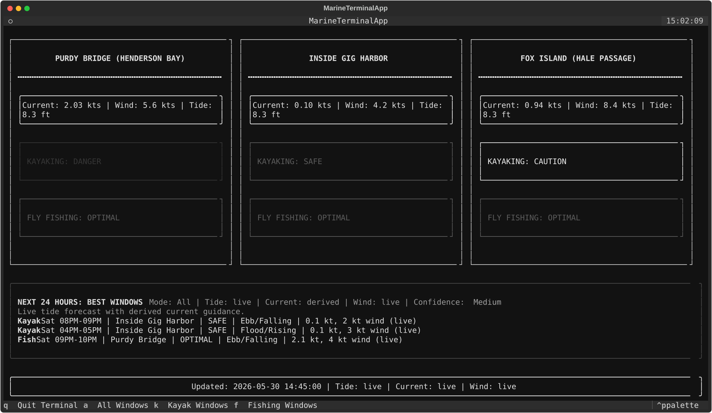

# TideWindow

TideWindow is a terminal and web marine-conditions dashboard for the Gig Harbor, Tacoma Narrows, and central Kitsap area. It combines NOAA tide/current observations and predictions with optional OpenWeather wind data, then scores local spots for kayaking and fly fishing. It also highlights the best kayak and fishing windows across a 72-hour planning window.

The web dashboard adds a Leaflet/OpenStreetMap area map, an hourly tide/wind/activity timeline, a remembered activity mode, and region-aware spot controls. You can choose Gig Harbor, Port Orchard, Bremerton, or Silverdale, show fewer or more nearby spots, and hide individual spots you do not use.

## Visuals

### Web dashboard



### Mobile layout



### Terminal dashboard



## Install

Use Python 3.10 or newer.

```bash
python3 -m venv .venv
source .venv/bin/activate
pip install -r requirements.txt
```

For editable command-line usage:

```bash
pip install -e .
```

## Optional Wind Data

TideWindow can run without an OpenWeather API key. If the key is missing, it uses a default wind value and labels the wind source as fallback data.

Create a `.env` file:

```bash
OPENWEATHER_API_KEY=your_api_key_here
```

## Run

```bash
python3 main.py
```

Or, after `pip install -e .`:

```bash
tidewindow
```

To run the web dashboard:

```bash
uvicorn web_app:app --reload
```

Then open `http://127.0.0.1:8000`.

The web dashboard serves the JavaScript, CSS, and API from the same FastAPI app, so production deployments do not need a separate frontend host or CORS setup.

Health check:

```bash
curl http://127.0.0.1:8000/health
```

Press `q` to quit.
Press `[` and `]` to page through current-condition areas.
Press `a` for all forecast windows, `k` for kayak windows, and `f` for fishing windows.

Current-condition areas include Purdy Bridge, Inside Gig Harbor, Fox Island/Hale Passage, Sunrise Beach Park, Narrows Park, Fox Island Fishing Pier, Purdy Sand Spit, and Kopachuck State Park.

The web dashboard starts with the top spots for the selected region. The selected region, visible spot count, hidden spots, and activity mode are stored in the browser.

## Forecast Windows

The forecast panel uses official NOAA tide predictions and NOAA current predictions when available. Tide forecast data is labeled as `live`; current forecast data is labeled as `predicted` when NOAA current predictions are available and `derived` only when TideWindow falls back to estimating current strength from the tide slope.

When `OPENWEATHER_API_KEY` has access to OpenWeather One Call 3.0, TideWindow also uses hourly wind forecast points for each window. Forecast wind is labeled as `live`, `fallback`, or `missing`; if hourly wind is unavailable, the app falls back to the current wind value for scoring and says so in the panel.

The app also displays a confidence label. `High` means live or official predicted marine data with light wind. `Medium` means live tide forecast with derived current guidance. `Low` means seed or missing forecast data is involved.

## Configuration

Edit `marine_config.py` to change NOAA station IDs, weather coordinates, refresh interval, forecast length, seeded fallback values, or local zone multipliers.

Runtime environment variables:

```bash
OPENWEATHER_API_KEY=your_api_key_here
TIDEWINDOW_WEB_APP_NAME=TideWindow
TIDEWINDOW_WEB_REFRESH_SECONDS=300
```

`OPENWEATHER_API_KEY` is optional. If it is missing or One Call 3.0 is not active yet, TideWindow labels wind data as fallback or missing and continues running.

## Deployment

TideWindow can run on any Python host that supports ASGI apps, such as Render, Fly.io, Railway, or a small VPS.

Typical build command:

```bash
pip install -r requirements.txt
```

Typical start command:

```bash
uvicorn web_app:app --host 0.0.0.0 --port $PORT
```

For hosts that do not provide `PORT`, use:

```bash
uvicorn web_app:app --host 0.0.0.0 --port 8000
```

Set `OPENWEATHER_API_KEY` in the host's environment settings if you want live OpenWeather wind observations and One Call 3.0 hourly wind forecasts. Set `TIDEWINDOW_WEB_REFRESH_SECONDS` to control how often the browser refreshes the dashboard data; the default is `300` seconds.

Use `/health` for uptime checks. It returns app status, version, timestamp, zone count, forecast length, refresh interval, configured NOAA stations, and whether an OpenWeather key is present. It does not call external providers, so uptime checks stay fast and do not consume API quota.

## Test

```bash
python3 -m unittest discover
```

## Data Sources

- NOAA CO-OPS API for tide and current observations
- NOAA CO-OPS API for tide and current predictions
- OpenWeather current weather API for optional wind observations
- OpenWeather One Call 3.0 API for optional hourly wind forecasts

This is a planning aid, not a substitute for marine forecasts, local knowledge, or personal judgment on the water.
