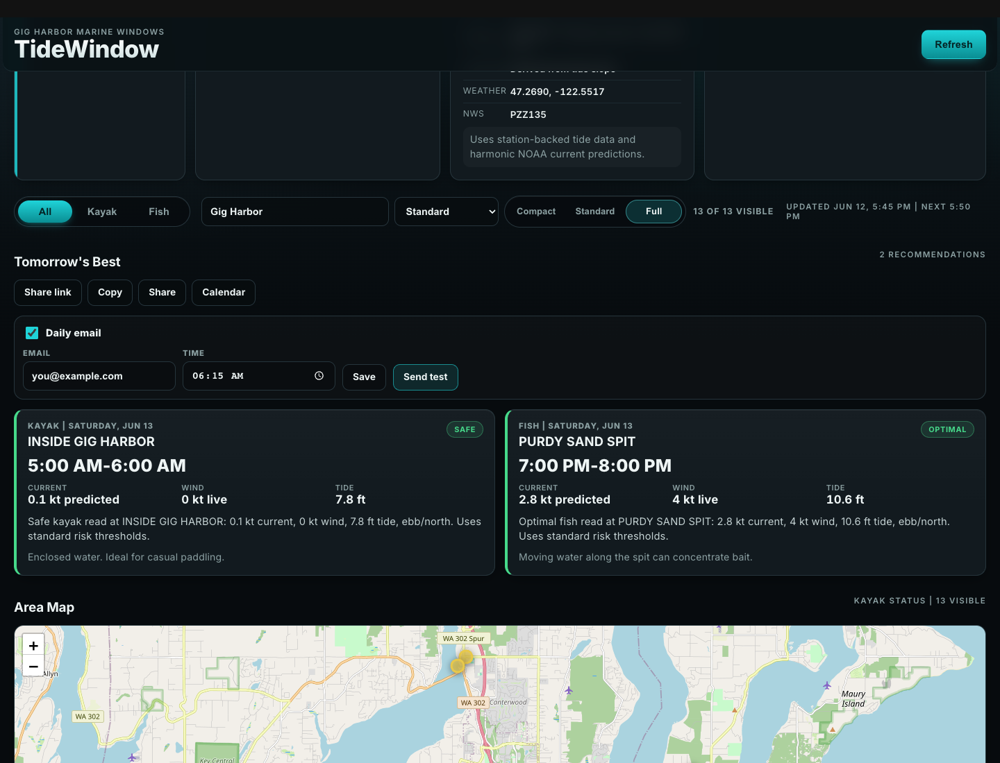
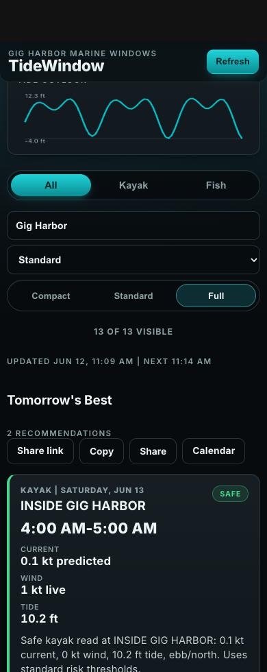
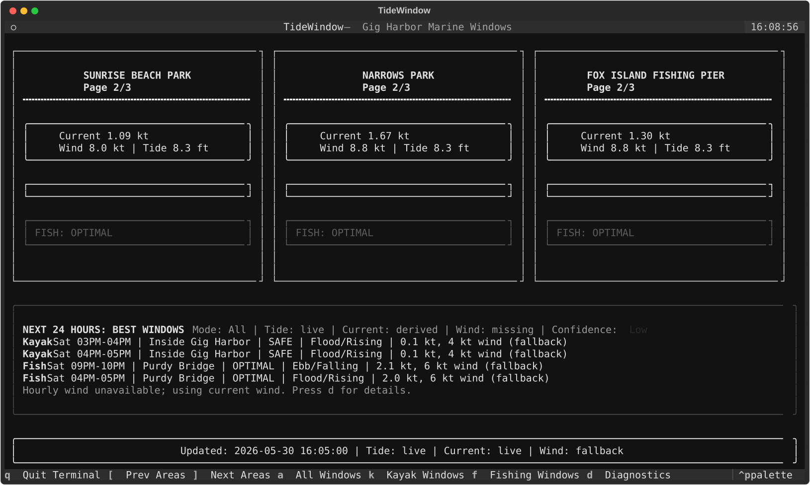

# TideWindow

TideWindow is a marine-planning dashboard for kayaking and fly fishing around Puget Sound, South Hood Canal, and the Aberdeen area. It combines NOAA tide/current data, optional OpenWeather wind data, regional spot catalogs, and local scoring rules to show when conditions look usable, risky, or especially good.

It runs as both a FastAPI web app and a terminal dashboard. The web app is the primary experience: map-first regional planning, Tomorrow's Best digest, daily heatmap, provider diagnostics, risk tolerance, shareable digest export, daily digest delivery, and digest operations admin.

## Screenshots

### Web dashboard



### Mobile layout



### Terminal dashboard



## What It Does

- Select a region or nearby place, then show the relevant fishing and kayak spots on a Leaflet/OpenStreetMap map.
- Score each spot for kayaking and fly fishing using tide, current, wind, wind exposure, and risk tolerance.
- Show a compact Daily Heatmap for the next 72 hours instead of a wall of hourly cards.
- Highlight Tomorrow's Best kayak and fish windows with share, copy, `.ics` calendar export, and optional daily email delivery.
- Review digest delivery health, readiness, saved preferences, and audit events from `/admin`.
- Label data honestly as live, predicted, derived, fallback, seed, stale, or missing.
- Explain provider fit by region, including NOAA tide/current station, bin/depth, active source, fallback path, and caveats.
- Install as a PWA and keep the last app shell/state available offline.

## Quick Start

Use Python 3.10 or newer.

```bash
python3 -m venv .venv
source .venv/bin/activate
pip install -r requirements.txt
```

Run the web dashboard:

```bash
.venv/bin/uvicorn web_app:app --reload
```

Open `http://127.0.0.1:8000`.

Run the terminal dashboard:

```bash
python3 main.py
```

Or install the editable CLI command:

```bash
pip install -e .
tidewindow
```

## Configuration

TideWindow works without an OpenWeather API key. When the key is missing, wind data is marked as fallback or missing and the app continues to run.

Optional `.env`:

```bash
OPENWEATHER_API_KEY=your_api_key_here
TIDEWINDOW_WEB_APP_NAME=TideWindow
TIDEWINDOW_WEB_REFRESH_SECONDS=300
TIDEWINDOW_PUBLIC_URL=https://your-app.example
TIDEWINDOW_DIGEST_SIGNING_SECRET=replace_with_a_long_random_secret
TIDEWINDOW_ADMIN_TOKEN=replace_with_a_long_random_admin_token
TIDEWINDOW_SCHEDULER_TOKEN=replace_with_a_long_random_scheduler_token
TIDEWINDOW_DIGEST_STORE=data/digest_preferences.json
TIDEWINDOW_DIGEST_OUTBOX=data/digest_outbox.json
```

Edit `marine_config.py` for core NOAA station defaults, refresh interval, forecast length, seeded fallback values, and local scoring thresholds. Edit `marine_regions.py` for regional catalogs, provider contexts, station candidates, aliases, and spot metadata.

Daily digest delivery writes to a local JSON outbox by default so it is testable without email credentials. Set `TIDEWINDOW_PUBLIC_URL` for hosted digest/unsubscribe links and keep `TIDEWINDOW_DIGEST_SIGNING_SECRET` stable so unsubscribe links remain valid. To send through SMTP, configure:

```bash
TIDEWINDOW_SMTP_HOST=smtp.example.com
TIDEWINDOW_SMTP_PORT=587
TIDEWINDOW_SMTP_USER=your_user
TIDEWINDOW_SMTP_PASSWORD=your_password
TIDEWINDOW_SMTP_FROM=digest@example.com
TIDEWINDOW_SMTP_TLS=1
```

## Web App Notes

The web dashboard starts with all spots for the selected region and offers Compact, Standard, and Full density controls when the map feels crowded. Place search accepts supported regions, city-style aliases, common launches, and marine-area names; nearby places such as Belfair, Union, Chico, and Gorst route to the closest supported region with a visible note.

Tomorrow's Best summarizes the strongest kayak and fish windows for the next day. The digest can be opened as a shareable `/digest` page, copied as text, shared through the browser, exported as an `.ics` calendar file, or saved as a daily email preference. Region, activity filter, risk tolerance, and spot density carry through those links and saved preferences. Daily emails include a signed unsubscribe link, and delivery/test/unsubscribe events are recorded in a local audit log.

Digest operations live at `/admin`. The admin view shows delivery health, scheduler readiness, saved preferences, recent audit rows, enable/disable controls, and send-test actions for saved preferences. Set `TIDEWINDOW_ADMIN_TOKEN` before exposing the app publicly; the admin page will prompt for that token before loading operational data or running admin actions.

## Terminal Notes

The terminal dashboard focuses on the original Gig Harbor/Narrows planning set. Press:

- `q` to quit
- `[` and `]` to page through current-condition areas
- `a` for all forecast windows
- `k` for kayak windows
- `f` for fishing windows

## Project Layout

```text
.
├── web_app.py              # FastAPI routes and dashboard API payloads
├── marine_engine.py        # Scoring, thresholds, windows, and timeline logic
├── marine_regions.py       # Region catalogs, aliases, provider context
├── noaa_client.py          # NOAA/OpenWeather fetchers and fallback logic
├── marine_terminal.py      # Textual terminal dashboard
├── static/                 # Browser app, digest page, PWA assets
├── tests/                  # Unit and API regression tests
├── scripts/                # NOAA station investigation helpers
├── docs/                   # Planning, reference docs, and screenshot assets
├── CHANGELOG.md            # Shipped history
└── docs/ROADMAP.md         # Forward-looking plan
```

## Documentation

- [Changelog](CHANGELOG.md)
- [Roadmap](docs/ROADMAP.md)
- [Digest delivery deployment checklist](docs/planning/DIGEST_DELIVERY_DEPLOYMENT.md)
- [Regional spot selection brief](docs/planning/REGIONAL_SPOT_SELECTION_BRIEF.md)
- [PWA/offline QA notes](docs/planning/PWA_OFFLINE_QA.md)
- [NOAA station candidates](docs/reference/NOAA_STATION_CANDIDATES_SOUTH_PUGET_SOUND_HOOD_CANAL.md)

Useful smoke scripts:

```bash
.venv/bin/python scripts/smoke_digest_delivery.py
.venv/bin/python scripts/smoke_digest_api.py http://127.0.0.1:8000
```

## Deployment

TideWindow can run on any Python host that supports ASGI apps, such as Render, Fly.io, Railway, or a small VPS.

Build command:

```bash
pip install -r requirements.txt
```

Start command:

```bash
uvicorn web_app:app --host 0.0.0.0 --port $PORT
```

Health check:

```bash
curl http://127.0.0.1:8000/health
```

The `/health` endpoint reports app version, zone/region counts, forecast length, refresh interval, provider metadata, and whether OpenWeather is configured. It does not call external providers.

To run due digest deliveries from a platform scheduler or cron:

```bash
curl -X POST "http://127.0.0.1:8000/api/digest-deliveries/run?run_id=$(date +%Y%m%d%H%M%S)&scheduler_token=$TIDEWINDOW_SCHEDULER_TOKEN"
```

The delivery runner uses a short-lived scheduler lock to avoid duplicate sends when overlapping workers fire. Set `TIDEWINDOW_SCHEDULER_TOKEN` before enabling hosted cron. Delivery audit records are available at `/api/digest-deliveries/audit?limit=50`.

Use `/admin` after enabling a scheduler to confirm readiness checks, subscription counts, last run id, delivery outcomes, and errors.

## Test

```bash
.venv/bin/python -m unittest discover
```

## Data Sources

- NOAA CO-OPS API for tide and current observations
- NOAA CO-OPS API for tide and current predictions
- NWS API for marine advisories
- OpenWeather current weather API for optional wind observations
- OpenWeather One Call 3.0 API for optional hourly wind forecasts

TideWindow is a planning aid, not a substitute for marine forecasts, local knowledge, or judgment on the water.
